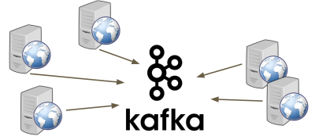
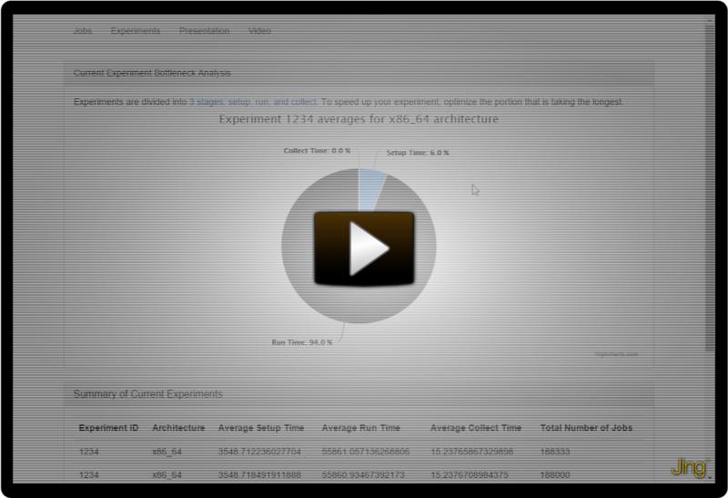

Performance Lab
=================

Performance Lab is my big data project for the January 2016 session of [Insight Data Engineering](http://insightdataengineering.com/)


## Intro
**Performance Lab** is an open-source data pipeline that integrates with [DataMill](https://datamill.uwaterloo.ca/) for analysis of historical and current experiments.
It makes use of the following technologies:
- Apache Kafka 0.8.2.2
- Apache Cassandra 2.2.4
- Apache Spark 1.5.2
- Redis 3.0.6
- Webdis
- AWS S3
- Django 1.9.0 with the following frameworks: HighCharts, jQuery, Bootstrap

For an explanation of the DataMill infrastructure please read [DataMill: Rigorous Performance Evaluation Made Easy](https://uwaterloo.ca/embedded-software-group/sites/ca.embedded-software-group/files/uploads/files/icpe13-datamill.pdf)
and the most recent paper, [DataMill: A Distributed Heterogeneous Infrastructure for Robust Experimentation](http://yuguangzhang.com/blog/wp-content/uploads/2015/11/document.pdf)

## The Data
Experiment results are stored in compressed gzip tar files. These files range from 10 Megabytes to 5 Gigabytes for a typical experiment. The CSV file within these tarballs contain 29 columns of factors and performance metrics. The key performance metrics captured by the infrastructure are setup, run, and collect time. There are only two scripts that every DataMill benchmark package must contain, `run.sh` and
`collect.sh`. These are the scripts that execute and collect data from the experiment, respectively.
If the package requires a setup procedure such as decompression, compilation, or dependency
installation, it may also contain a `setup.sh` script, which is executed before `run.sh`.

* Historyical Data
	* 500 GB from 2013 -2016
* Real-time data
	* Average 2,300 jobs / sec
	* 16 simulated workers



## Connecting To Google Cloud Storage

The pipeline obtains experiment data from DataMill using the [gsutil Tool](https://cloud.google.com/storage/docs/gsutil_install?hl=en#install). Experiment result tarballs are uploaded to Google Cloud Storage upon completion of all jobs scheduled for the experiment. The gsutil client is used to download historical experiment data which are stored as tarballs for each experiment. 

## Pipeline Overview


The CSV result files are extracted from experiment result tarballs and uploaded to S3 for batch processing. Individual lines from the CSV result files representing finished jobs are sent to Kafka to simulate workers as jobs are finished. CSV headers provide the schema for the columns, which varies from experiment to experiment. The CSV files are read directly as DataFrames in Spark for processing. 

Real time jobs are simulated by replaying lines from CSV files for historical experiments. For each experiment, finished job data is sent to a Kafka topic as **result** messages until the number of jobs for the experiment reaches a threshold. Once an experiment is done, a **done** message is sent to Kafka to indicate the end of an experiment. 

Spark batch processes CSV files from S3 and saves computed values for visualization to Cassandra. Spark streaming consumes data from Kafka and calculates the number of jobs and average time for each stage of an experiment as finished jobs are submitted to Kafka. Real time experiment statistics are then written to Redis and pushed to clients. 
  
## Batch Processing
CSV file sizes vary from 10 Megabytes to 5 Gigabytes. I chose to use **S3** to store these files to avoid taking up large blocks for small files on HDFS. I process them in **Spark**, dropping rows with null values for any of the performance metrics. The performance metrics are setup, run, and collect times. I calculate averages of these metrics for each factor that has more than one level. 

## Realtime Processing

Data from **Kafka** is processed with **Spark** micro-batching. The **Kafka** retention period is set to 3 seconds to prevent Kafka logs from filling up available disk space. Instead of displaying the p-value or ANOVA tables for experiments, I decided to show pie charts of the amount of time each stage of the benchmark takes. I have implemented a one way ANOVA function in `com.hastyexperiment.ExperimentResultStream` called `calculateOneWayAnova`. It takes as input an experiment ID, a DataFrame of jobs from parseJobs, and a factor name. However, a better analysis of DataMill experiments would involve multiple factors. Although a 2k factorial design is ideal for multiple factors, many experiments incorporate custom software factors. In addition, due to the design of experiments involving multiple levels for hardware factors, I have decided to only show pie charts of the time spent on experiments for various architectures. These pie charts are useful for researchers who want to find out which part of their experiments are taking the longest on different architectures.
  
## Video

[](http://yuguangzhang.com/videos/performance-lab.html)

## Command Line Examples
Start multiple producers to send experiment results to Kafka:
```
./kafka/spawn_multiple_producers.sh <kafka-ip> 16 k1 <kafka-topic>
```

Compile and run Spark streaming project
```
cd spark_stream
sbt assembly
sbt package 
spark-submit --class ExperimentResultStream --executor-memory 6000M --driver-memory 6000M --jars ./target/scala-2.10/spark_stream-assembly-1.0.jar ./target/scala-2.10/spark_stream_2.10-1.0.jar
```

Run Spark batch job
```
$SPARK_HOME/bin/spark-submit --packages com.databricks:spark-csv_2.10:1.3.0,TargetHolding:pyspark-cassandra:0.2.5 --conf spark.cassandra.connection.host="<cassandra-ip>" experiment_statistics.py >/tmp/spark.out
```

## Presentation Deck
My presentation slides are available at https://docs.google.com/presentation/d/16Cj8dXRG0MKeDmQfVPRXGk25Tkhr_DuWOgBfK37i5rk/pub?start=false&loop=false&delayms=3000&slide=id.p
